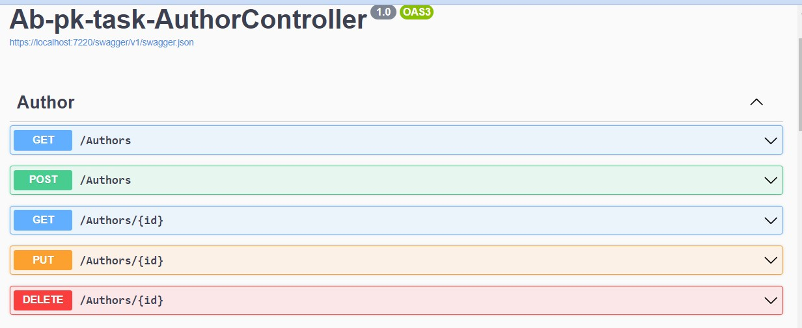
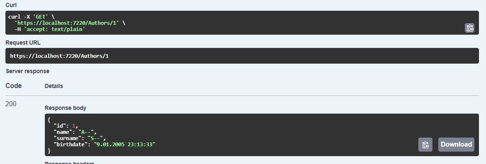
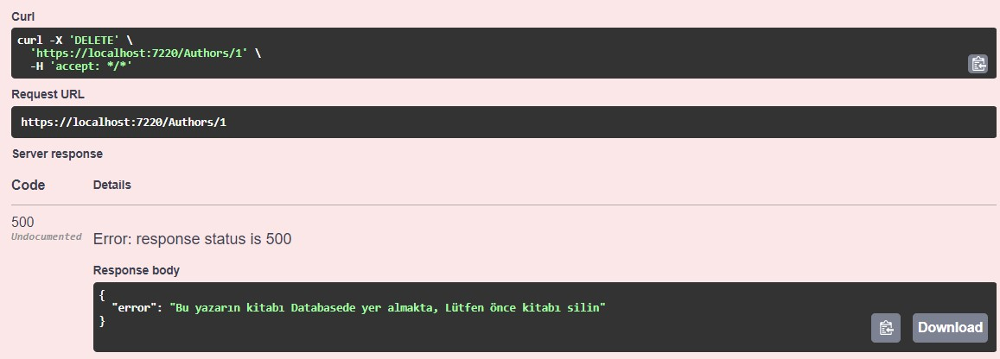
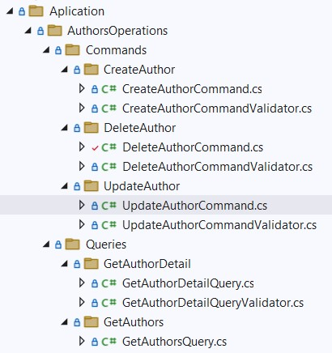

# Akbank .Net Bootcamp Cohort Görev Author Controller

Akbank ve patikadev tarafından gerçekleştirilen Asp.Net eğitimi sürecinde verilen cohort üzerinden verilen görev.

## Bizden İstenenler:
- 1.Projeye kitapların yazarları için Author controller'ı ekleyiniz. Bu controller ile aşağıdaki işlemlerin gerçeklenebilmesi gerekmektedir.

        Yazar Ekleme
        Yazar Bilgileri Güncelleme
        Yazar Silme
        Tüm Yazarları Listeleme
        Spesifik Bir Yazarın Bilgilerini Getirme

- 2.Yazar Bilgileri:

        Ad
        Soyad
        Doğum Tarihi

- 3.Kitap - Yazar - Tür entity ilişkilerini kurunuz. Bİr kitabın yalnızca bir yazarı olabilir varsayımında bulunabilirsiniz.

    Kitabı yayında olan bir yazar silinememeli. Öncelikle kitap silinmeli, daha sonra yazar silinebilir.

- 4.Author için model ve dto'ları ekleyiniz. Controller metotları entity'leri input veya output olarak kullanmamalı.

- 5.Author entity model map'lerini Auto Mapper kullanarak yazınız.

- 6.Author servisleri için Fluent Validation kullanarak validation sınıflarını yazınız. Kuralları uygun gördüğünüz şekilde belirleyebilirsiniz.

- 7.Servisler içerisinden anlamlı hata mesajları fırlatılmalı.

